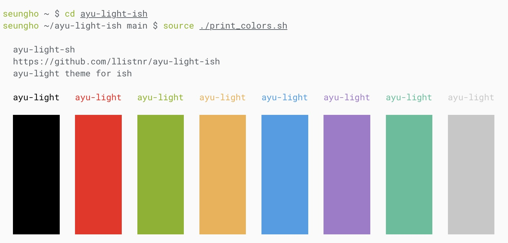

# ayu-light-ish

ayu-light theme for iSH.

- **ayu** [GitHub Repo](https://github.com/dempfi/ayu)
- **iSH** [GitHub Repo](https://github.com/ish-app/ish)

## Installation

1. Download `ayu-light.json`.
2. Import json file in iSH via `Settings > Appearance > Theme > Edit > Import Theme`.
3. Select `ayu-light` from `USER THEMES`.

